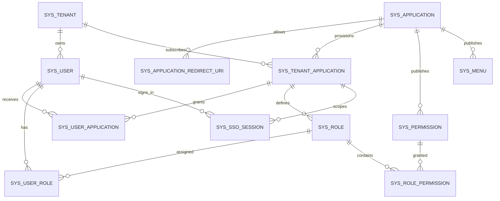

# 平台“应用开通 + 单点登录”库表结构设计

> 适用范围：`bin-platform` 作为统一身份与应用管理中心；AI 能力由具体业务应用按需引入 `bin-ai-*` 依赖。  
> 数据库：MySQL 8.0，字符集沿用 `utf8mb4_0900_ai_ci`。  
> 文档性质：目标模型与迁移设计，不是可直接上线执行的 Flyway 脚本。

## 1. 需求结论

当前平台已经具备租户、用户、角色、权限、菜单和 JWT 登录，但现有授权模型只有“租户”边界，没有“应用”边界。若一个租户同时开通平台管理端、AI 工作台和其他应用，现有模型会出现以下问题：

- 用户登录后无法可靠计算“可进入的应用列表”；
- 不同应用的角色、权限和菜单可能互相串用；
- 当前 JWT 没有目标应用，任意持有平台 Token 的请求可能被其他应用接受；
- 租户到期与单个应用到期无法分别控制；
- 应用停用、用户应用授权撤销后，已经签发的 Token 缺少可追踪、可撤销的应用会话。

因此建议引入两级模型：

1. `sys_application` 表示平台发布的应用产品，例如 `platform-console`、`ai-workbench`；
2. `sys_tenant_application` 表示某租户开通的一个应用实例，是开通状态、有效期和访问策略的唯一事实来源。

`sys_user` 继续表示租户级统一身份，**不要增加 `application_id`**。角色改为租户应用实例级，权限和菜单改为应用产品级。用户点击应用时，用平台登录态换取短时、一次性授权码，再由应用后端换取带应用受众的 Token。

`bin-ai` 当前是能力依赖库而不是可启动服务，因此不应把 `bin-ai` Maven 父模块本身登记为可点击应用。应由实际承载 AI 页面和 API 的业务服务登记为应用，例如 `ai-workbench`，该服务再依赖 `bin-ai-core`、`bin-ai-chat-tencent`、`bin-ai-retrieval-milvus` 等模块。

## 2. 领域关系



边界原则：

- 身份边界：`tenant_id + user_id`；
- 开通边界：`tenant_application_id`；
- 授权边界：`tenant_application_id + role_id`；
- 资源归属：`application_id + permission/menu`；
- Token 边界：`aud = application.code` 且携带 `tenantApplicationId`。

## 3. 新增表

所有状态字段建议使用稳定字符串而不是数据库 ENUM，Java 侧用枚举约束，便于后续扩展和灰度迁移。

### 3.1 `sys_application`：应用产品目录

平台运营方维护的全局表。一条记录表示一个可开通、可展示、可作为 Token 受众的应用产品。

| 字段 | 类型 | 必填 | 默认值 | 说明 |
|---|---|---:|---|---|
| `id` | BIGINT | 是 | - | 雪花主键 |
| `code` | VARCHAR(64) | 是 | - | 稳定唯一编码，同时作为 JWT `aud`，如 `ai-workbench`；发布后不可修改 |
| `name` | VARCHAR(100) | 是 | - | 应用名称 |
| `description` | VARCHAR(500) | 是 | `''` | 应用简介 |
| `icon_url` | VARCHAR(500) | 是 | `''` | 应用图标地址 |
| `entry_url` | VARCHAR(500) | 是 | - | 默认入口，仅用于导航，不作为回调白名单 |
| `service_id` | VARCHAR(100) | 是 | - | 网关/Nacos 服务标识，用于授权码兑换时校验调用方 |
| `status` | VARCHAR(16) | 是 | `ENABLED` | `ENABLED`、`DISABLED`、`OFFLINE` |
| `sso_enabled` | TINYINT(1) | 是 | `1` | 是否允许平台发起 SSO |
| `sort` | INT | 是 | `10` | 应用列表排序，越小越靠前 |
| `version` | INT | 是 | `0` | 乐观锁版本 |
| `is_delete` | TINYINT | 是 | `0` | 逻辑删除 |
| 审计字段 | - | 是 | - | `gmt_create/gmt_modify/create_user/modify_user` |

约束与索引：

- 活跃数据唯一：`UNIQUE(active_code)`，其中 `active_code = CASE WHEN is_delete=0 THEN code END`；
- `UNIQUE(service_id)`，保证调用服务只能映射一个应用；
- 列表索引：`(status, sort, is_delete)`。

建议初始化两条记录：

- `platform-console`：现有平台管理端，所有租户创建时自动开通；
- `ai-workbench`：实际承载 AI 页面/API 的业务应用，而非 `bin-ai` 依赖聚合模块。

### 3.2 `sys_application_redirect_uri`：SSO 回调白名单

一个应用允许多个环境或多个前端入口。回调必须与表中记录做规范化后的**精确匹配**，禁止前缀匹配和任意 `returnUrl`。

| 字段 | 类型 | 必填 | 默认值 | 说明 |
|---|---|---:|---|---|
| `id` | BIGINT | 是 | - | 主键 |
| `application_id` | BIGINT | 是 | - | 应用产品 ID |
| `environment` | VARCHAR(16) | 是 | `PROD` | `DEV`、`TEST`、`STAGING`、`PROD` |
| `redirect_uri` | VARCHAR(500) | 是 | - | 授权码回调地址，必须 HTTPS；本地 DEV 可例外允许 loopback |
| `logout_uri` | VARCHAR(500) | 是 | `''` | 单点退出回调地址 |
| `available` | TINYINT(1) | 是 | `1` | 是否启用 |
| `version/is_delete` | - | 是 | `0` | 乐观锁与逻辑删除 |
| 审计字段 | - | 是 | - | 标准审计字段 |

约束与索引：

- `UNIQUE(application_id, active_redirect_uri)`；
- `FOREIGN KEY(application_id) REFERENCES sys_application(id)`。

### 3.3 `sys_tenant_application`：租户应用开通实例

本功能的核心表。应用开通、暂停、到期、关闭都只改变该表，不改变全局应用目录。

| 字段 | 类型 | 必填 | 默认值 | 说明 |
|---|---|---:|---|---|
| `id` | BIGINT | 是 | - | 租户应用实例 ID，后续授权和 Token 均引用它 |
| `tenant_id` | BIGINT | 是 | - | 租户 ID |
| `application_id` | BIGINT | 是 | - | 应用产品 ID |
| `status` | VARCHAR(16) | 是 | `PENDING` | `PENDING`、`ACTIVE`、`SUSPENDED`、`EXPIRED`、`CLOSED` |
| `access_policy` | VARCHAR(16) | 是 | `ASSIGNED` | `ALL`=租户全部有效用户可见；`ASSIGNED`=仅显式授权用户可见 |
| `entry_url_override` | VARCHAR(500) | 是 | `''` | 租户专属入口覆盖；只用于导航，不能成为 SSO 回调白名单 |
| `opened_at` | DATETIME | 否 | NULL | 首次开通时间 |
| `effective_at` | DATETIME | 否 | NULL | 生效时间；NULL 表示立即生效 |
| `expire_at` | DATETIME | 否 | NULL | 到期时间；NULL 表示长期有效 |
| `suspended_at` | DATETIME | 否 | NULL | 暂停时间 |
| `closed_at` | DATETIME | 否 | NULL | 关闭时间 |
| `config_json` | JSON | 否 | NULL | 少量非敏感、低查询频率的租户应用配置；禁止存密钥 |
| `comment` | VARCHAR(500) | 是 | `''` | 开通备注 |
| `version/is_delete` | - | 是 | `0` | 乐观锁与逻辑删除 |
| 审计字段 | - | 是 | - | 标准审计字段 |

约束与索引：

- 一个租户同一应用仅一个活跃实例：`UNIQUE(tenant_id, active_application_id)`；
- 为复合外键补充 `UNIQUE(tenant_id, application_id, id)`；
- 应用列表查询索引：`(tenant_id, status, expire_at, is_delete)`；
- 外键分别引用 `sys_tenant(id)` 与 `sys_application(id)`。

状态判定必须同时满足：租户有效且未到期、应用产品为 `ENABLED`、开通实例为 `ACTIVE`、已到生效时间且未过期。定时任务可以把显示状态推进为 `EXPIRED`，但实时鉴权不能只依赖定时任务，仍需比较 `expire_at`。

### 3.4 `sys_user_application`：用户应用访问授权

仅在 `access_policy=ASSIGNED` 时作为准入名单。该表只表示“能否进入应用”，不替代应用内 RBAC。

| 字段 | 类型 | 必填 | 默认值 | 说明 |
|---|---|---:|---|---|
| `id` | BIGINT | 是 | - | 主键 |
| `tenant_id` | BIGINT | 是 | - | 冗余租户 ID，用于隔离和复合外键 |
| `tenant_application_id` | BIGINT | 是 | - | 租户应用实例 ID |
| `user_id` | BIGINT | 是 | - | 用户 ID |
| `status` | VARCHAR(16) | 是 | `ACTIVE` | `ACTIVE`、`DISABLED` |
| `effective_at` | DATETIME | 否 | NULL | 授权生效时间 |
| `expire_at` | DATETIME | 否 | NULL | 用户级授权到期时间 |
| `granted_by` | BIGINT | 否 | NULL | 授权操作人用户 ID；系统自动授权可为空 |
| `granted_at` | DATETIME | 是 | CURRENT_TIMESTAMP | 授权时间 |
| `comment` | VARCHAR(500) | 是 | `''` | 备注 |
| `version/is_delete` | - | 是 | `0` | 乐观锁与逻辑删除 |
| 审计字段 | - | 是 | - | 标准审计字段 |

约束与索引：

- `UNIQUE(tenant_application_id, active_user_id)`；
- `(tenant_id, user_id)` 引用 `sys_user(tenant_id, id)`；
- `(tenant_id, tenant_application_id)` 引用 `sys_tenant_application(tenant_id, id)`；
- 用户应用列表索引：`(tenant_id, user_id, status, expire_at, is_delete)`。

### 3.5 `sys_sso_session`：应用会话与撤销状态

平台登录会话和应用会话应分开。每次成功兑换授权码，建立一条应用会话，用于单应用退出、全局退出、强制下线和刷新令牌轮换。

| 字段 | 类型 | 必填 | 默认值 | 说明 |
|---|---|---:|---|---|
| `id` | BIGINT | 是 | - | 主键 |
| `session_id` | VARCHAR(64) | 是 | - | 高熵随机会话 ID，对应 JWT `sid` |
| `tenant_id` | BIGINT | 是 | - | 租户 ID |
| `application_id` | BIGINT | 是 | - | 应用产品 ID，对应 JWT `aud` |
| `tenant_application_id` | BIGINT | 是 | - | 租户应用实例 ID |
| `user_id` | BIGINT | 是 | - | 用户 ID |
| `status` | VARCHAR(16) | 是 | `ACTIVE` | `ACTIVE`、`REVOKED`、`EXPIRED` |
| `refresh_token_hash` | CHAR(64) | 否 | NULL | 刷新令牌 SHA-256 摘要；绝不保存原文 |
| `auth_time` | DATETIME | 是 | CURRENT_TIMESTAMP | 原始身份认证时间 |
| `last_access_at` | DATETIME | 否 | NULL | 最近访问/刷新时间，允许异步低频更新 |
| `expire_at` | DATETIME | 是 | - | 会话绝对过期时间 |
| `revoked_at` | DATETIME | 否 | NULL | 撤销时间 |
| `revoke_reason` | VARCHAR(200) | 是 | `''` | `LOGOUT`、`USER_DISABLED`、`APP_SUSPENDED` 等 |
| `client_ip` | VARCHAR(45) | 是 | `''` | IPv4/IPv6；展示时脱敏 |
| `user_agent` | VARCHAR(500) | 是 | `''` | 客户端摘要，不记录额外个人数据 |
| `version/is_delete` | - | 是 | `0` | 乐观锁与逻辑删除 |
| 审计字段 | - | 是 | - | 标准审计字段 |

约束与索引：

- `UNIQUE(session_id)`、`UNIQUE(refresh_token_hash)`；
- 活跃会话查询：`(tenant_application_id, user_id, status, expire_at)`；
- 全局退出查询：`(tenant_id, user_id, status)`；
- 通过复合外键保证用户、租户应用实例和应用产品属于同一边界。

高风险接口可按 `sid` 查询 Redis/数据库校验会话；普通接口使用短时 Access Token，并在开通状态、授权或会话撤销时把 `sid` 写入 Redis 黑名单，TTL 等于 Token 剩余时间。

### 3.6 `sys_sso_login_log`：SSO 审计日志

追加写审计表，不做逻辑删除，不存授权码、Access Token、Refresh Token 或 URL 查询串。

| 字段 | 类型 | 必填 | 默认值 | 说明 |
|---|---|---:|---|---|
| `id` | BIGINT | 是 | - | 主键 |
| `tenant_id` | BIGINT | 否 | NULL | 租户 ID |
| `application_id` | BIGINT | 否 | NULL | 目标应用 ID |
| `tenant_application_id` | BIGINT | 否 | NULL | 目标开通实例 ID |
| `user_id` | BIGINT | 否 | NULL | 用户 ID |
| `event_type` | VARCHAR(32) | 是 | - | `TICKET_ISSUED`、`CODE_EXCHANGED`、`LOGOUT`、`REVOKED` |
| `success` | TINYINT(1) | 是 | `1` | 是否成功 |
| `failure_code` | VARCHAR(64) | 是 | `''` | 稳定失败码，不记录敏感细节 |
| `session_id` | VARCHAR(64) | 是 | `''` | 可关联会话；失败时可为空字符串 |
| `trace_id` | VARCHAR(64) | 是 | `''` | 全链路追踪 ID |
| `client_ip` | VARCHAR(45) | 是 | `''` | 客户端 IP |
| `user_agent` | VARCHAR(500) | 是 | `''` | User-Agent 摘要 |
| `event_time` | DATETIME | 是 | CURRENT_TIMESTAMP | 事件时间 |

索引建议：`(tenant_id, event_time)`、`(user_id, event_time)`、`(application_id, event_time)`、`(session_id)`、`(success, event_time)`。按月归档或分区，保留期由安全与合规策略确定。

## 4. 现有基础表的必要调整

### 4.1 `sys_tenant`：保留租户级生命周期

现有结构基本可用。`expire_time` 表示租户整体到期，单个应用到期放在 `sys_tenant_application.expire_at`。不要用租户到期时间承载套餐或应用期限。

建议把代码中的布尔 `available` 逐步演进为明确状态字段并记录禁用原因，但这不是应用开通一期的阻塞项。租户被禁用/到期时，应撤销该租户全部平台与应用会话。

### 4.2 `sys_user`：保持统一身份，不挂应用

不增加 `application_id`，否则一个人使用多个应用时会产生多份账号和密码，无法形成真正的统一登录。现有用户名、手机号唯一约束均以租户为范围，符合当前租户登录模式。

建议补充：

- `credential_version INT NOT NULL DEFAULT 0`：改密、强制下线时递增并写入 JWT，用于批量使旧 Token 失效；
- `last_login_at DATETIME NULL`：仅做账号安全展示；详细事件仍写审计日志；
- 邮箱若作为登录凭证，增加与手机号同类的软删除唯一键；若不用于登录则无需唯一。

### 4.3 `sys_role`：从租户级改为租户应用实例级

必须新增：

- `application_id BIGINT NOT NULL`；
- `tenant_application_id BIGINT NOT NULL`。

角色编码唯一范围从 `(tenant_id, code)` 改为 `(tenant_application_id, code)`。这样同一租户可在不同应用内都拥有 `ADMIN`，含义互不干扰。`application_id` 虽可由开通实例推导，但保留它可以通过复合外键在数据库层保证角色、权限属于同一应用，并优化鉴权查询。

`data_scope` 当前包含“部门”语义，但仓库没有部门表。若近期没有组织架构，应先只支持 `ALL`、`SELF`，避免提供无法执行的枚举；若要支持部门数据权限，应另行增加组织/部门与用户部门关系，不应靠一个数值字段假装完成。

### 4.4 `sys_permission`：改为应用产品级资源目录

现有 `tenant_id` 可空且 `code` 全局唯一，不适合多应用。目标结构：

- 删除 `tenant_id`，新增 `application_id BIGINT NOT NULL`；
- 唯一范围改为 `(application_id, code)`；
- 权限编码仍建议带应用前缀，例如 `ai:knowledge-base:create`，提高日志可读性；
- 权限由应用发布者管理，租户只能把已有权限分配给自己的应用角色，不能修改资源定义。

通配权限 `*` 不应跨所有应用传播。可使用应用内 `*`，或使用 `ai:*`，且只允许平台内置超级管理员角色获得跨应用能力。

### 4.5 `sys_menu`：改为应用产品级导航资源

新增 `application_id BIGINT NOT NULL`，菜单树的父子关系必须属于同一应用。菜单只是导航投影，继续通过 `permission` 控制显示，服务端仍以 `sys_permission` 做最终授权。

建议新增：

- `route_name VARCHAR(100) NOT NULL DEFAULT ''`：前端稳定路由名；
- `open_mode VARCHAR(16) NOT NULL DEFAULT 'INTERNAL'`：`INTERNAL`、`NEW_TAB`、`IFRAME`；
- `(application_id, parent_id, sort)` 索引；
- `(application_id, permission)` 索引。

平台登录结果不再返回所有应用菜单。登录只返回平台壳所需信息和应用列表；进入某应用并兑换应用 Token 后，再按 `application_id + 当前应用角色` 获取该应用菜单。

### 4.6 `sys_user_role`：增加应用实例边界

新增 `application_id` 和 `tenant_application_id`，唯一键调整为：

```text
(tenant_application_id, user_id, role_id)
```

用复合外键确保用户与角色属于同一租户，角色与开通实例属于同一应用。禁止只校验 `role_id` 是否存在就分配，否则平台管理员角色可能被错误分配到 AI 应用。

### 4.7 `sys_role_permission`：增加应用一致性约束

新增 `application_id` 和 `tenant_application_id`。角色属于租户应用实例，权限属于应用产品；写入时必须验证两者 `application_id` 相同。唯一键建议：

```text
(tenant_application_id, role_id, permission_id)
```

### 4.8 `sys_operate_log`：补充应用审计维度

现有日志有租户和操作人，但无法判断操作发生在哪个应用。建议增加：

- `application_id BIGINT NULL`；
- `tenant_application_id BIGINT NULL`；
- `trace_id VARCHAR(64) NOT NULL DEFAULT ''`；
- `session_id VARCHAR(64) NOT NULL DEFAULT ''`。

平台级、登录失败等无法确定应用的事件允许为空。不要把请求 Token 或完整敏感参数写入 `params`。

### 4.9 多租户拦截器调整

当前忽略表包含 `sys_menu`、`sys_permission`，这两张表改为应用级全局资源后仍可忽略租户条件，但查询必须显式带 `application_id`。新增表建议如下：

| 表 | 是否由租户插件自动追加 `tenant_id` | 原因 |
|---|---:|---|
| `sys_application` | 否 | 全局应用目录 |
| `sys_application_redirect_uri` | 否 | 全局安全白名单 |
| `sys_tenant_application` | 是 | 租户开通数据 |
| `sys_user_application` | 是 | 租户用户授权 |
| `sys_role` / 关系表 | 是 | 租户应用内授权 |
| `sys_permission` / `sys_menu` | 否 | 应用发布的全局资源，但必须显式限定应用 |
| `sys_sso_session` | 是 | 租户应用会话 |
| `sys_sso_login_log` | 否 | 跨租户安全审计，必须由受控服务显式查询 |

后台任务和内部调用不能因为没有用户上下文就普遍使用 `@TenantIgnore`。应传入明确的 `tenantId`，跨租户任务逐租户执行并记录审计。

## 5. 应用开通事务

开通一个应用建议在单个本地事务中完成：

1. 校验租户、应用产品状态和唯一性；
2. 写入 `sys_tenant_application(PENDING)`；
3. 根据应用发布清单或初始化配置，为该实例幂等创建内置角色并绑定应用权限；
4. 按 `access_policy` 给租户管理员写 `sys_user_application`；
5. 外部资源初始化（Milvus collection、ES index、第三方资源等）通过事务消息/Outbox 异步执行；
6. 外部资源全部成功后更新为 `ACTIVE`，失败保持 `PENDING` 或进入 `FAILED` 扩展状态并支持幂等重试；
7. 写操作日志并清理用户应用列表缓存。

MySQL 事务不能包住 Milvus、Elasticsearch 或第三方 API。不要在数据库事务内直接把开通状态改成 `ACTIVE` 后再调用外部系统。若 AI 应用需要独立知识库资源，资源名应包含稳定的 `tenant_application_id`，而不是可修改的租户编码或应用名称。

关闭应用采用软关闭：先把状态改为 `CLOSED`，撤销活跃应用会话并停止新票据签发；业务数据按保留策略异步归档/删除。恢复开通时复用还是新建实例，需要在产品策略中明确，默认建议恢复原实例以保留审计连续性。

## 6. 单点登录流程

### 6.1 登录与应用列表

1. 用户在平台完成现有用户名/手机号登录，得到平台 Token，`aud=platform-console`；
2. `/applications/mine` 联查租户开通状态和用户准入：
   - `access_policy=ALL`，或存在有效 `sys_user_application`；
   - 租户、应用产品、开通实例、用户都有效且均未到期；
3. 返回应用名称、图标和平台生成的 launch API 地址，不直接把任意回调 URL交给前端拼接。

### 6.2 点击应用与授权码兑换

1. 前端调用 `POST /sso/authorize`，参数为 `tenantApplicationId`、白名单 `redirectUri`、随机 `state`；
2. 平台重新校验应用准入，生成至少 256 bit 的随机授权码；
3. Redis 仅存授权码 SHA-256 摘要，内容含用户、租户、应用、回调 URI、平台会话 ID，TTL 建议 60 秒，并使用原子 GET-AND-DELETE 保证一次性；
4. 浏览器跳转到 `redirectUri?code=...&state=...`；
5. 应用后端经受信网关调用 `POST /sso/token` 兑换。网关服务身份必须与 `sys_application.service_id` 一致；
6. 平台创建 `sys_sso_session` 并签发应用 Token；应用前端不在 URL、localStorage 或日志中长期保存 Token，优先使用 Secure、HttpOnly、SameSite Cookie；
7. 应用后端获取自己的菜单和权限，进入应用首页。

不要把平台 JWT 直接拼在跳转 URL 中，也不要让授权码可重复兑换。`state` 由发起端生成并原样校验，用于防 CSRF；回调地址必须精确匹配白名单。

### 6.3 应用 Token 最小声明

```json
{
  "sub": "userId",
  "tenantId": "tenantId",
  "tenantApplicationId": "tenantApplicationId",
  "aud": "ai-workbench",
  "sid": "random-session-id",
  "jti": "random-token-id",
  "credentialVersion": 3,
  "roles": ["ADMIN"],
  "iat": 0,
  "exp": 0
}
```

网关除了验签和过期时间，还必须按路由校验 `aud`。例如 AI 路由只接受 `aud=ai-workbench`，不能接受平台 Token。JWT 中的角色只是性能快照；应用停用、授权撤销、改密和强制退出通过短 Token TTL、`sid/jti` 黑名单以及会话状态共同收敛。

### 6.4 退出

- 单应用退出：撤销当前 `sys_sso_session`，应用 Token 加黑名单，不影响平台和其他应用；
- 平台全局退出：撤销该平台会话派生的全部应用会话。若需高效实现，可在 `sys_sso_session` 增加 `parent_session_id`；
- 用户禁用、租户禁用、应用暂停/关闭、用户应用授权撤销：批量撤销对应应用会话；
- 退出回调失败不应恢复会话，采用重试和审计日志处理。

## 7. 关键查询规则

用户可见应用列表的逻辑等价于：

```sql
SELECT a.id, a.code, a.name, a.icon_url,
       COALESCE(NULLIF(ta.entry_url_override, ''), a.entry_url) AS entry_url
FROM sys_tenant_application ta
JOIN sys_application a
  ON a.id = ta.application_id
 AND a.status = 'ENABLED'
 AND a.is_delete = 0
JOIN sys_tenant t
  ON t.id = ta.tenant_id
 AND t.available = 1
 AND t.is_delete = 0
 AND (t.expire_time IS NULL OR t.expire_time > NOW())
JOIN sys_user u
  ON u.tenant_id = ta.tenant_id
 AND u.id = :userId
 AND u.available = 1
 AND u.is_delete = 0
WHERE ta.tenant_id = :tenantId
  AND ta.status = 'ACTIVE'
  AND ta.is_delete = 0
  AND (ta.effective_at IS NULL OR ta.effective_at <= NOW())
  AND (ta.expire_at IS NULL OR ta.expire_at > NOW())
  AND (
      ta.access_policy = 'ALL'
      OR EXISTS (
          SELECT 1
          FROM sys_user_application ua
          WHERE ua.tenant_id = ta.tenant_id
            AND ua.tenant_application_id = ta.id
            AND ua.user_id = :userId
            AND ua.status = 'ACTIVE'
            AND ua.is_delete = 0
            AND (ua.effective_at IS NULL OR ua.effective_at <= NOW())
            AND (ua.expire_at IS NULL OR ua.expire_at > NOW())
      )
  )
ORDER BY a.sort, a.id;
```

应用权限聚合查询必须同时限定 `user_id`、`tenant_id`、`tenant_application_id` 和 `application_id`，不能继续只按 `userId` 缓存。权限缓存 Key 至少改为：

```text
user-permission:{tenantId}:{tenantApplicationId}:{userId}:{credentialVersion}
```

角色、权限、菜单、用户应用授权或开通状态变化时，失效对应应用实例范围内的缓存，而不是无差别清空全平台缓存。

## 8. 参考建表骨架

以下仅展示新增核心表的骨架。正式 Flyway 迁移应拆成“建新表/加可空列 → 回填 → 建约束 → 切换代码 → 收紧非空”的多阶段脚本。

```sql
CREATE TABLE sys_application (
    id BIGINT NOT NULL,
    code VARCHAR(64) NOT NULL,
    name VARCHAR(100) NOT NULL,
    description VARCHAR(500) NOT NULL DEFAULT '',
    icon_url VARCHAR(500) NOT NULL DEFAULT '',
    entry_url VARCHAR(500) NOT NULL,
    service_id VARCHAR(100) NOT NULL,
    status VARCHAR(16) NOT NULL DEFAULT 'ENABLED',
    sso_enabled TINYINT(1) NOT NULL DEFAULT 1,
    sort INT NOT NULL DEFAULT 10,
    version INT NOT NULL DEFAULT 0,
    is_delete TINYINT NOT NULL DEFAULT 0,
    active_code VARCHAR(64) GENERATED ALWAYS AS
        (CASE WHEN is_delete = 0 THEN code ELSE NULL END) STORED,
    gmt_create DATETIME NOT NULL DEFAULT CURRENT_TIMESTAMP,
    gmt_modify DATETIME NOT NULL DEFAULT CURRENT_TIMESTAMP ON UPDATE CURRENT_TIMESTAMP,
    create_user VARCHAR(64) NOT NULL DEFAULT 'system',
    modify_user VARCHAR(64) NOT NULL DEFAULT 'system',
    PRIMARY KEY (id),
    UNIQUE KEY uk_application_active_code (active_code),
    UNIQUE KEY uk_application_service_id (service_id),
    KEY idx_application_list (status, sort, is_delete)
) ENGINE=InnoDB DEFAULT CHARSET=utf8mb4 COLLATE=utf8mb4_0900_ai_ci;

CREATE TABLE sys_tenant_application (
    id BIGINT NOT NULL,
    tenant_id BIGINT NOT NULL,
    application_id BIGINT NOT NULL,
    status VARCHAR(16) NOT NULL DEFAULT 'PENDING',
    access_policy VARCHAR(16) NOT NULL DEFAULT 'ASSIGNED',
    entry_url_override VARCHAR(500) NOT NULL DEFAULT '',
    opened_at DATETIME NULL,
    effective_at DATETIME NULL,
    expire_at DATETIME NULL,
    suspended_at DATETIME NULL,
    closed_at DATETIME NULL,
    config_json JSON NULL,
    comment VARCHAR(500) NOT NULL DEFAULT '',
    version INT NOT NULL DEFAULT 0,
    is_delete TINYINT NOT NULL DEFAULT 0,
    active_application_id BIGINT GENERATED ALWAYS AS
        (CASE WHEN is_delete = 0 THEN application_id ELSE NULL END) STORED,
    gmt_create DATETIME NOT NULL DEFAULT CURRENT_TIMESTAMP,
    gmt_modify DATETIME NOT NULL DEFAULT CURRENT_TIMESTAMP ON UPDATE CURRENT_TIMESTAMP,
    create_user VARCHAR(64) NOT NULL DEFAULT 'system',
    modify_user VARCHAR(64) NOT NULL DEFAULT 'system',
    PRIMARY KEY (id),
    UNIQUE KEY uk_tenant_application_active (tenant_id, active_application_id),
    UNIQUE KEY uk_tenant_application_tenant_id (tenant_id, id),
    UNIQUE KEY uk_tenant_application_boundary (tenant_id, application_id, id),
    KEY idx_tenant_application_list (tenant_id, status, expire_at, is_delete),
    CONSTRAINT fk_tenant_application_tenant FOREIGN KEY (tenant_id) REFERENCES sys_tenant(id),
    CONSTRAINT fk_tenant_application_application FOREIGN KEY (application_id) REFERENCES sys_application(id)
) ENGINE=InnoDB DEFAULT CHARSET=utf8mb4 COLLATE=utf8mb4_0900_ai_ci;

CREATE TABLE sys_user_application (
    id BIGINT NOT NULL,
    tenant_id BIGINT NOT NULL,
    tenant_application_id BIGINT NOT NULL,
    user_id BIGINT NOT NULL,
    status VARCHAR(16) NOT NULL DEFAULT 'ACTIVE',
    effective_at DATETIME NULL,
    expire_at DATETIME NULL,
    granted_by BIGINT NULL,
    granted_at DATETIME NOT NULL DEFAULT CURRENT_TIMESTAMP,
    comment VARCHAR(500) NOT NULL DEFAULT '',
    version INT NOT NULL DEFAULT 0,
    is_delete TINYINT NOT NULL DEFAULT 0,
    active_user_id BIGINT GENERATED ALWAYS AS
        (CASE WHEN is_delete = 0 THEN user_id ELSE NULL END) STORED,
    gmt_create DATETIME NOT NULL DEFAULT CURRENT_TIMESTAMP,
    gmt_modify DATETIME NOT NULL DEFAULT CURRENT_TIMESTAMP ON UPDATE CURRENT_TIMESTAMP,
    create_user VARCHAR(64) NOT NULL DEFAULT 'system',
    modify_user VARCHAR(64) NOT NULL DEFAULT 'system',
    PRIMARY KEY (id),
    UNIQUE KEY uk_user_application_active (tenant_application_id, active_user_id),
    KEY idx_user_application_list (tenant_id, user_id, status, expire_at, is_delete),
    CONSTRAINT fk_user_application_user FOREIGN KEY (tenant_id, user_id)
        REFERENCES sys_user(tenant_id, id),
    CONSTRAINT fk_user_application_instance FOREIGN KEY (tenant_id, tenant_application_id)
        REFERENCES sys_tenant_application(tenant_id, id)
) ENGINE=InnoDB DEFAULT CHARSET=utf8mb4 COLLATE=utf8mb4_0900_ai_ci;
```

检查约束如 `status`、时间范围可在应用服务统一校验；如果数据库规范允许，也可增加 `CHECK`，例如 `expire_at IS NULL OR effective_at IS NULL OR expire_at > effective_at`。

## 9. 迁移顺序

1. 新建应用目录、回调白名单、租户应用和用户应用授权表；
2. 初始化 `platform-console`，为每个现有租户生成对应开通实例；
3. 给角色、权限、菜单及关联表增加可空的应用字段；
4. 将现有平台权限/菜单归入 `platform-console`，现有租户角色归入各自的开通实例；
5. 为关联表回填应用边界，执行孤儿数据和跨应用关系检查；
6. 上线同时支持旧/新 Token 的过渡代码，新增 `aud` 和 `tenantApplicationId`；
7. 切换权限缓存与查询条件，网关启用路由受众校验；
8. 把新列收紧为非空并建立复合外键、唯一键；
9. 删除旧唯一键及 `sys_permission.tenant_id` 等不再使用的列；
10. 最后启用 AI 应用开通，不应先开放入口再补应用隔离。

每一步都应提供可重复的数据核对 SQL。尤其要检查：同一角色是否关联多个应用权限、菜单父子是否跨应用、用户角色是否跨租户/跨应用实例、同一租户是否存在多个活跃开通实例。

## 10. 一期范围与后续扩展

一期建议只实现应用目录、租户开通、用户准入、应用级 RBAC、授权码 SSO、会话撤销和审计。以下内容不建议提前混入核心表：

- 套餐、计费、订单：后续独立 `product/plan/subscription/order` 域；
- AI Token 配额、模型配额：属于 AI 应用业务域，按 `tenant_application_id` 建表；
- Milvus/Elasticsearch 连接密钥：放密钥管理或 Nacos 密文配置，不放 `config_json`；
- 第三方 OAuth/OIDC：后续可增加标准 Client、Consent、Authorization Grant 表；
- 部门数据权限：等组织架构模型明确后独立设计。

这套设计保证 `bin-platform` 只负责统一身份、开通、准入和 SSO，AI 领域数据仍由实际 AI 应用拥有，并统一使用 `tenant_id + tenant_application_id` 做隔离。


## 11. 2026-08-31 实现复核结论

核心模型按一期落地。具体实现及启动验收见 [APPLICATION_PROVISIONING_IMPLEMENTATION.md](APPLICATION_PROVISIONING_IMPLEMENTATION.md)。本地学习使用 DEV 精确 HTTP 回调；本次采用统一升级并使旧 Token 失效，替代第 9 节的旧 Token 并行过渡；暂保留 permission/menu 的 tenant_id 兼容列。实际演示应用为 open-api 承载的 learning-workbench，不将 bin-ai 能力模块误当作已经完成的独立应用。外部资源尚未发生，因此开通在数据库事务中完成，不引入空转的 Outbox。
